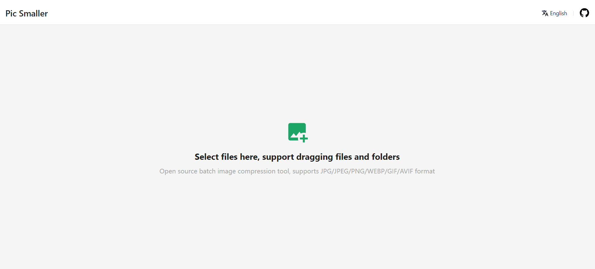
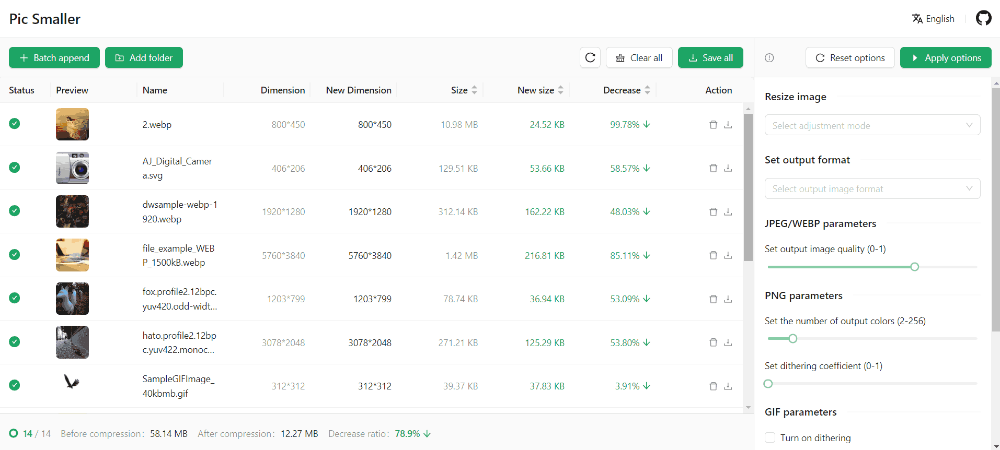

# Easy Compression 

**Easy Compression** is a super easy-to-use online image compression tool. Simply upload your desired image(s), and Easy Compression will automatically perform its compress functionality and provide details on the results. Users can also customize features to suite their desired output, such as setting the output format or number of output colors. It's intuitive, website and mobile friendly, and supports compression configuration. At the same time, because of purely local compression without any server-side logic, it is completely safe.

 

Figure 1: Easy Compression's landing page, where users can upload their images for compression
 
 

Figure 2: Example pictures uploaded for compression shown on the left, and Easy Compression's customizable compression and editing features shown on the right
 
 

Figure 3: Easy Compression's comparison tool, that the user can drag to see the difference between the original and compressed image
 
 

